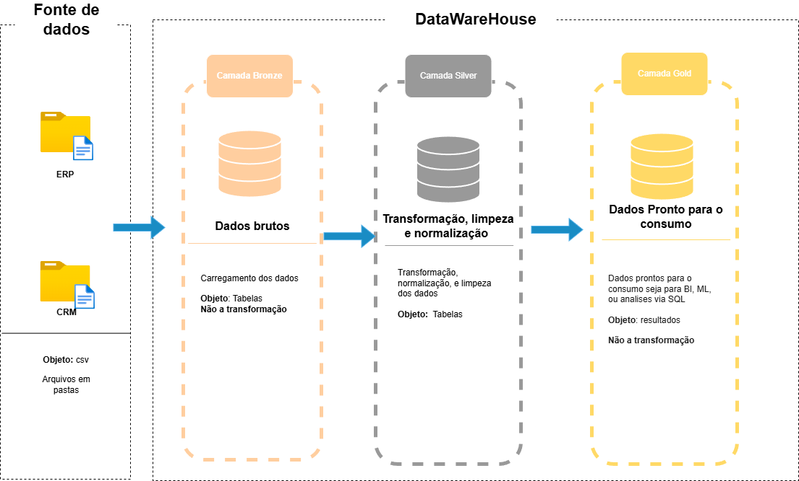

# DataWarehouse feito completamente no SQLserver
Criação de um Data Warehouse usando SQL Server, incluindo processo de ETL e modelagem de dados.
---
### Arquitetura do DataWarehouse

- [Catalogo de dados da camada gold](https://github.com/lucasghidini/sql-datawarehouse/blob/main/docs/catalgo_dados.md)

## Camada Bronze
Nesta camada, primeiramente, foi realizada a criação das tabelas que receberão os dados [bronze_ddl](https://github.com/lucasghidini/sql-datawarehouse/blob/main/scripts/bronze/bronze_ddl.sql).
As bases de dados são duas: ERP e CRM.
Assim como é o padrão para a camada Bronze, não há alteração dos dados, apenas o carregamento inicial.

Após a criação das tabelas (com base nas colunas das fontes de dados), desenvolvi um Stored Procedure (procedimento armazenado) [carregamento_dados_bronze](https://github.com/lucasghidini/sql-datawarehouse/blob/main/scripts/bronze/carregamento_dados_bronze.sql) no SQL Server para realizar o carregamento dos dados para as respectivas tabelas.

O procedimento é executado com o seguinte comando:
 ```bash
   exec bronze.load_data
```

---

### Camada Silver
Primeiramente, foram criadas as tabelas na camada Silver, conforme detalhado no script [silver_ddl.sql](https://github.com/lucasghidini/sql-datawarehouse/blob/main/scripts/silver/silver_ddl.sql)

Em seguida, foi realizado todo o tratamento de dados necessário para as tabelas, incluindo a padronização de datas e de outros dados, bem como a remoção de espaços desnecessários (limpeza de dados).

Também foi criado o procedimento armazenado (Stored Procedure) para o carregamento, que é executado através do comando:

```bash
  exec silver.load_data
```

## Camada Gold
Nesta etapa, iniciamos a criação de objetos para consumo, utilizando Views (Visualizações) em vez de tabelas físicas. 
O objetivo principal desta camada é disponibilizar os dados de forma otimizada para os usuários finais ou sistemas de Business Intelligence (BI).

As tabelas com conteúdo similar (ou correlacionado) foram unidas nessas Views para facilitar e otimizar a consulta e o consumo dos dados.
### Integração dos dados


Aqui é demonstrada a estrutura relacional entre as diferentes entidades de dados, especificando as conexões entre as colunas. 
Para o consumo de dados, foram criadas três Views (Visualizações) que seguem o modelo dimensional:

- `dim_clientes`: Contém as informações detalhadas dos clientes (Tabela de Dimensão).
- `dim_produtos`: Contém as informações detalhadas dos produtos (Tabela de Dimensão).
- `fato_vendas`: Contém os dados das transações e vendas (Tabela de Fatos).

Para a junção dos dados na visualização `fato_vendas`, foram utilizadas chaves substitutas (Surrogate Keys), criadas especificamente nesta camada (Gold). O objetivo é garantir a integridade e otimizar o relacionamento da Tabela de Fatos com as Tabelas de Dimensão, conforme ilustrado no diagrama a seguir:


O código de criação das Views (Visualizações) para esta camada está disponível no script [gold_ddl.](https://github.com/lucasghidini/sql-datawarehouse/blob/main/scripts/gold/gold_ddl.sql)

Para garantir a governança e facilitar a utilização e o entendimento dos dados pelos usuários finais e equipes de BI, foi desenvolvido um Catálogo de Dados que detalha a estrutura e o conteúdo de cada View:   [catalago de dados.](https://github.com/lucasghidini/sql-datawarehouse/blob/main/docs/catalgo_dados.md)


--- 
Com este projeto, acredito que foi possível demonstrar meu conhecimento em SQL avançado, modelagem dimensional e a implementação prática de uma arquitetura de Data Warehouse completa no SQL Server, desde a ingestão bruta até a modelagem para consumo analítico.

Lucas Ghidini, 2025
